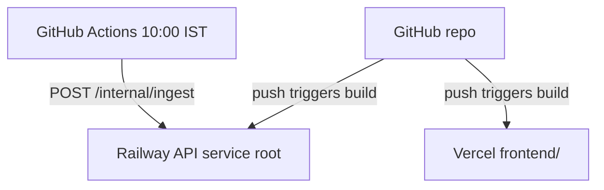
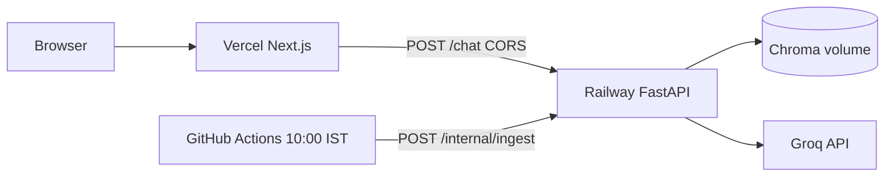

# Deployment plan: Railway (backend) + Vercel (frontend)

Deploy **from GitHub** on both platforms: one repository, two connected projects. Pushes to your production branch redeploy the backend and frontend automatically (after you finish one-time setup below).

| Layer | Platform | Connect | Repo path | Config in repo |
|-------|----------|---------|-----------|----------------|
| **Backend** | [Railway](https://railway.app/) | **Deploy from GitHub** | Repository **root** | `railway.toml` |
| **Daily ingest** | [GitHub Actions](https://docs.github.com/en/actions) | Same repo | `.github/workflows/daily-ingest.yml` | 10:00 IST → Railway `/internal/ingest` |
| **Frontend** | [Vercel](https://vercel.com/) | **Import Git Repository** | **`frontend/`** only | `frontend/vercel.json` |

**Related docs:** [deployment.md](deployment.md) (reference) · [ingest-schedule.md](ingest-schedule.md) (10:00 IST GitHub Actions) · [railway-ingest.md](railway-ingest.md) (API ingest endpoint)

### GitHub setup (do this first)

1. Push this project to a **GitHub** repository (main branch for production is typical).
2. Do **not** commit secrets — set `GROQ_API_KEY` and `INGEST_TRIGGER_SECRET` in Railway; `RAILWAY_API_BASE_URL` + `INGEST_TRIGGER_SECRET` in GitHub Actions secrets; Vercel env for the UI.
3. Grant Railway and Vercel access to that repo when each platform asks during **Deploy from GitHub** / **Import**.



**After setup:** `git push` redeploys Railway API and Vercel. The Chroma volume and dashboard env vars are **not** reset by git. Daily ingest is triggered by the Actions schedule (see §3).

---

## 1. Target architecture



**Prerequisites**

- GitHub repository with this code (Railway + Vercel both use **Deploy from GitHub** on that repo)
- [Groq API key](https://console.groq.com/keys) for answer generation (Railway variables only)
- Repo contains `railway.toml`, `.github/workflows/daily-ingest.yml`, `frontend/vercel.json`

**Recommended deploy order (GitHub flow)**

1. **Railway** — Deploy from GitHub → API service (root), volume + env vars (including ingest)
2. Bootstrap Chroma index on Railway (shell or `/internal/ingest`)
3. **GitHub** — Repository secrets for daily ingest workflow (§3)
4. **Vercel** — Import same GitHub repo, root directory `frontend`, env vars
5. Update Railway `CORS_ORIGINS` with real Vercel URLs from the first Vercel deploy
6. Run ingest workflow once manually; then end-to-end verification

---

## 2. Railway — API service (backend)

### 2.1 Connect GitHub and create the API service

| Step | Action |
|------|--------|
| 1 | [Railway](https://railway.app/) → **New Project** → **Deploy from GitHub** |
| 2 | Authorize Railway for your GitHub account if prompted → select **this repository** |
| 3 | **Root directory:** leave empty / repo root — **not** `frontend/` (backend code is at top level) |
| 4 | **Production branch:** usually `main` (Railway Settings → Source) |
| 5 | **Config file:** `railway.toml` (repo root; Railway reads build/start from here) |
| 6 | First deploy starts automatically from the latest commit on that branch |

Railway builds from `railway.toml` on each git push (no manual upload). Confirm the build installs Playwright + Python deps as defined there.

Railway will run:

```bash
pip install -r requirements.txt -r requirements-phase1.txt -r requirements-phase2.txt && pip install certifi && playwright install chromium && playwright install-deps chromium
```

Start command (from `railway.toml` / `Procfile`):

```bash
uvicorn src.main:app --host :: --port $PORT
```

**Health check:** `/health` (timeout 120s in config — first deploy may be slow while dependencies install)

### 2.2 Persistent volume (Chroma)

| Step | Action |
|------|--------|
| 1 | API service → **Volumes** → Add volume |
| 2 | Mount path: `/app/data` |
| 3 | Set env: `VECTOR_DB_PATH=data/chroma` |

The index lives on disk at `data/chroma` under the mount. Without a volume, redeploys wipe the corpus.

### 2.3 API environment variables

Set these in Railway → API service → **Variables**:

| Variable | Required | Value / notes |
|----------|----------|----------------|
| `GROQ_API_KEY` | **Yes** | From [console.groq.com/keys](https://console.groq.com/keys) — never commit |
| `VECTOR_DB_PATH` | **Yes** | `data/chroma` (with volume at `/app/data`) |
| `CORS_ORIGINS` | **Yes** | Comma-separated; include `http://localhost:3000` and **every** Vercel URL that will call the API (see §4) |
| `ENABLE_INTERNAL_INGEST` | **Yes** (prod) | `true` — allows cron/manual ingest |
| `INGEST_TRIGGER_SECRET` | **Yes** (prod) | Long random string; same value on cron service |
| `LLM_MODEL` | No | Default `llama-3.3-70b-versatile` |
| `ALLOWED_DOMAINS` | No | Defaults in `.env.example` (AMC, AMFI, SEBI) |

**CORS placeholder** (update after Vercel deploy):

```bash
CORS_ORIGINS=https://your-production.vercel.app,https://your-project-git-main-user.vercel.app,http://localhost:3000
```

Optional tuning (defaults usually fine): `RETRIEVAL_MIN_SCORE`, `CHAT_RATE_LIMIT_PER_MINUTE`, `LOG_LEVEL` — see `.env.example`.

### 2.4 Bootstrap the vector index (first deploy)

Before users can chat, Chroma must be populated **once** on the API service:

**Option A — Railway shell (recommended)**

```bash
pip install -r requirements-phase1.txt
python -m src.ingest --manifest corpus/urls.yaml --no-save-raw
```

**Option B — HTTP trigger** (after deploy, `ENABLE_INTERNAL_INGEST=true`)

```bash
curl -X POST "https://<your-api>.up.railway.app/internal/ingest" \
  -H "Authorization: Bearer <INGEST_TRIGGER_SECRET>"
```

**Verify:**

```bash
curl https://<your-api>.up.railway.app/health
curl https://<your-api>.up.railway.app/corpus-status
```

Expect `chunk_count` > 0 and a recent `last_ingest` after a successful run.

### 2.5 Note the public API URL

Railway → API service → **Settings** → **Networking** → copy the public URL (e.g. `https://mf-rag-api-production.up.railway.app`).

You will use this for:

- Vercel `NEXT_PUBLIC_API_BASE_URL`
- GitHub secret `RAILWAY_API_BASE_URL` (same host, no trailing slash)
- Manual `curl` checks

---

## 3. GitHub Actions — Daily ingest (10:00 IST)

Production corpus refresh: [ingest-schedule.md](ingest-schedule.md). Workflow: [`.github/workflows/daily-ingest.yml`](../.github/workflows/daily-ingest.yml).

Ingest runs **on the Railway API** (where Chroma lives). The workflow only sends `POST /internal/ingest`; it does not update production if ingest runs on the Actions runner instead.

### 3.1 Railway API (required for trigger)

On the API service:

| Variable | Value |
|----------|--------|
| `ENABLE_INTERNAL_INGEST` | `true` |
| `INGEST_TRIGGER_SECRET` | Long random string |

### 3.2 GitHub repository secrets

Repo → **Settings** → **Secrets and variables** → **Actions**:

| Secret | Value |
|--------|--------|
| `RAILWAY_API_BASE_URL` | Same public URL as Vercel `NEXT_PUBLIC_API_BASE_URL` (no trailing slash) |
| `INGEST_TRIGGER_SECRET` | **Same** as Railway |

### 3.3 Verify schedule

| Step | Action |
|------|--------|
| 1 | Actions → **Daily corpus refresh (10:00 IST)** → **Run workflow** (manual test) |
| 2 | Railway API logs → `Starting scheduled corpus ingest` |
| 3 | `curl https://<api>/corpus-status` → `last_ingest` updated, `chunk_count` > 0 |

Scheduled runs: `30 4 * * *` UTC = **10:00 IST**, default branch only. GitHub may start the job a few minutes late; ingest often finishes between ~10:00 and ~11:00 IST. Until it completes, users still see the **previous** successful index.

**Optional:** Railway cron second service — [railway-ingest.md](railway-ingest.md) Option B. Skip if using GitHub Actions only.

---

## 4. Vercel — Frontend

### 4.1 Connect GitHub and create the project

| Step | Action |
|------|--------|
| 1 | [Vercel](https://vercel.com/) → **Add New…** → **Project** → **Import Git Repository** |
| 2 | Install / authorize the **Vercel GitHub App** if prompted → select the **same repo** as Railway |
| 3 | **Root Directory:** click **Edit** → set to `frontend` (required — API lives at repo root) |
| 4 | **Production Branch:** usually `main` |
| 5 | **Framework:** Next.js (auto-detected; `frontend/vercel.json` sets install/build) |
| 6 | **Build command:** `npm run build` (default) → **Deploy** |

Every push to `main` redeploys **Production**. Other branches get **Preview** deployments (separate URLs — add each to Railway `CORS_ORIGINS` if you test against production API).

### 4.2 Frontend environment variables

| Variable | Environments | Value |
|----------|----------------|-------|
| `NEXT_PUBLIC_API_BASE_URL` | Production, Preview | `https://<railway-api-host>` (no trailing slash) |
| `NEXT_PUBLIC_APP_NAME` | Optional | e.g. `MF Facts Assistant` |

Copy from `frontend/.env.example` for local dev:

```bash
NEXT_PUBLIC_API_BASE_URL=http://127.0.0.1:8000
```

### 4.3 Deploy and collect URLs

After the first Vercel deploy, note:

- **Production URL** — e.g. `https://mf-rag-chatbot.vercel.app`
- **Preview URLs** — branch deploys like `https://mf-rag-chatbot-git-<branch>-<user>.vercel.app`

---

## 5. Wire backend and frontend together

### 5.1 Update Railway CORS

Add **exact** origins (scheme + host + port) for every Vercel URL that should call `/chat`:

1. Railway → API → Variables → `CORS_ORIGINS`
2. Append production + preview origins + `http://localhost:3000`
3. **Redeploy** the API service

Example:

```bash
CORS_ORIGINS=https://mf-rag-chatbot.vercel.app,https://mf-rag-chatbot-git-main-you.vercel.app,http://localhost:3000
```

Each new preview domain used for testing must be added the same way.

### 5.2 Redeploy Vercel if API URL changed

If you changed the Railway public URL, update `NEXT_PUBLIC_API_BASE_URL` on Vercel and redeploy.

---

## 6. Verification checklist

### 6.1 Backend (Railway)

| Check | Command / action | Expected |
|-------|------------------|----------|
| Health | `curl https://<api>/health` | 200, healthy |
| Corpus | `curl https://<api>/corpus-status` | `chunk_count` > 0 |
| Ingest auth | `POST /internal/ingest` with Bearer secret | 200 when idle; 409 if already running |

### 6.2 Frontend (Vercel)

| Check | Action | Expected |
|-------|--------|----------|
| Disclaimer | Open Vercel URL | Amber banner visible at top |
| Example question | Click an example | Network: `POST …/chat` → 200 |
| Factual answer | Ask expense ratio / exit load | Green user bubble, white assistant card, **Official source** link, footer date |
| Refusal | Ask “Should I invest?” | Amber refusal card with educational link |
| CORS | Browser devtools | No CORS errors on `/chat` |

### 6.3 Local full-stack (optional)

| Service | Command | URL |
|---------|---------|-----|
| API | `uvicorn src.main:app --reload` | http://127.0.0.1:8000 |
| UI | `cd frontend && npm run dev` | http://localhost:3000 |

Root `.env`: `CORS_ORIGINS` includes `http://localhost:3000`.  
`frontend/.env.local`: `NEXT_PUBLIC_API_BASE_URL=http://127.0.0.1:8000`.

---

## 7. Post-deploy operations

| Topic | Behavior |
|-------|----------|
| **Code updates** | `git push` to GitHub → Railway + Vercel rebuild from latest commit; Chroma data stays on Railway volume |
| **Env / secret changes** | Edit variables in Railway or Vercel UI → redeploy (or trigger redeploy); not stored in git |
| **Daily refresh** | 10:00 IST — GitHub Actions → `POST /internal/ingest` on API; no Vercel redeploy |
| **Stale answers** | Check `GET /corpus-status`; Actions run history; API logs after 10:00 IST |
| **Manual re-ingest** | Actions → Run workflow, or Railway shell, or `curl` with Bearer secret |
| **Secrets** | Rotate `INGEST_TRIGGER_SECRET` in Railway **and** GitHub; rotate `GROQ_API_KEY` in Railway only |

---

## 8. Troubleshooting

| Symptom | Likely cause | Fix |
|---------|--------------|-----|
| Browser: blocked by CORS | Origin not in `CORS_ORIGINS` | Add exact Vercel URL; redeploy Railway API |
| Network failed / API unreachable | Wrong `NEXT_PUBLIC_API_BASE_URL` | Match Railway public URL; no trailing slash |
| 502 / unhealthy on Railway | Missing Chroma or failed build | Check logs; confirm volume + bootstrap ingest |
| Empty or generic answers | Empty index | Run bootstrap ingest; verify `corpus-status` |
| Ingest workflow failed on secrets | Missing GitHub secrets | Set `RAILWAY_API_BASE_URL` + `INGEST_TRIGGER_SECRET` |
| Trigger 401/403 | Secret mismatch | Align Railway and GitHub `INGEST_TRIGGER_SECRET` |
| Ingest 409 | Overlapping runs | Wait; check API logs |
| `/internal/ingest` 404 | Ingest disabled | Set `ENABLE_INTERNAL_INGEST=true` on API |

---

## 9. Repository artifacts (quick reference)

| File | Purpose |
|------|---------|
| `railway.toml` | API build, start, health check |
| `.github/workflows/daily-ingest.yml` | 10:00 IST → Railway ingest trigger |
| `railway.ingest.toml` | Optional Railway cron (not needed with GitHub schedule) |
| `Procfile` | Alternative Railway start: `web: uvicorn …` |
| `frontend/vercel.json` | Vercel Next.js build settings |
| `.env.example` | Backend env template |
| `frontend/.env.example` | Frontend env template |

---

## 10. Deployment sign-off

Use this table when handing off or demoing production:

| # | Item | Done |
|---|------|------|
| 1 | GitHub repo pushed; Railway **Deploy from GitHub** (API, repo root) | ☐ |
| 2 | Railway API uses `railway.toml`; production branch connected | ☐ |
| 3 | Volume mounted at `/app/data`, `VECTOR_DB_PATH=data/chroma` | ☐ |
| 4 | `GROQ_API_KEY`, `ENABLE_INTERNAL_INGEST`, `INGEST_TRIGGER_SECRET` set in Railway | ☐ |
| 5 | Bootstrap ingest completed; `corpus-status` OK | ☐ |
| 6 | GitHub secrets: `RAILWAY_API_BASE_URL`, `INGEST_TRIGGER_SECRET`; manual workflow run OK | ☐ |
| 7 | Vercel **Import Git Repository**, root = `frontend`, API URL in env | ☐ |
| 8 | `CORS_ORIGINS` includes all Vercel + localhost origins | ☐ |
| 9 | E2E chat, citation, and refusal flows verified | ☐ |

When all boxes are checked, production matches the architecture in §1: users on Vercel, facts and ingest on Railway, generation via Groq.
