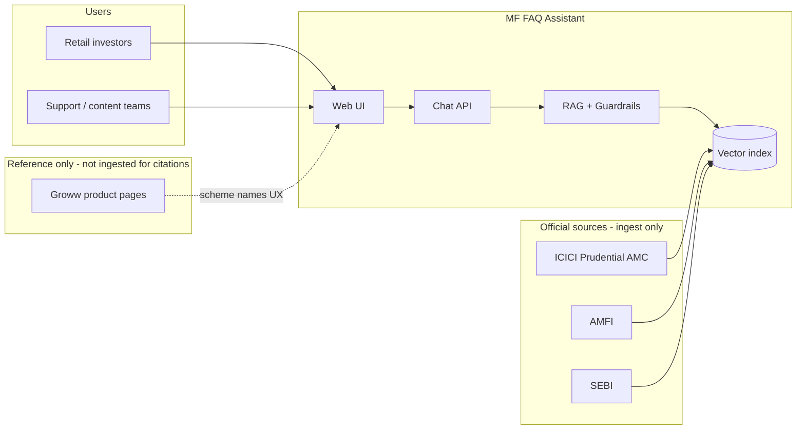
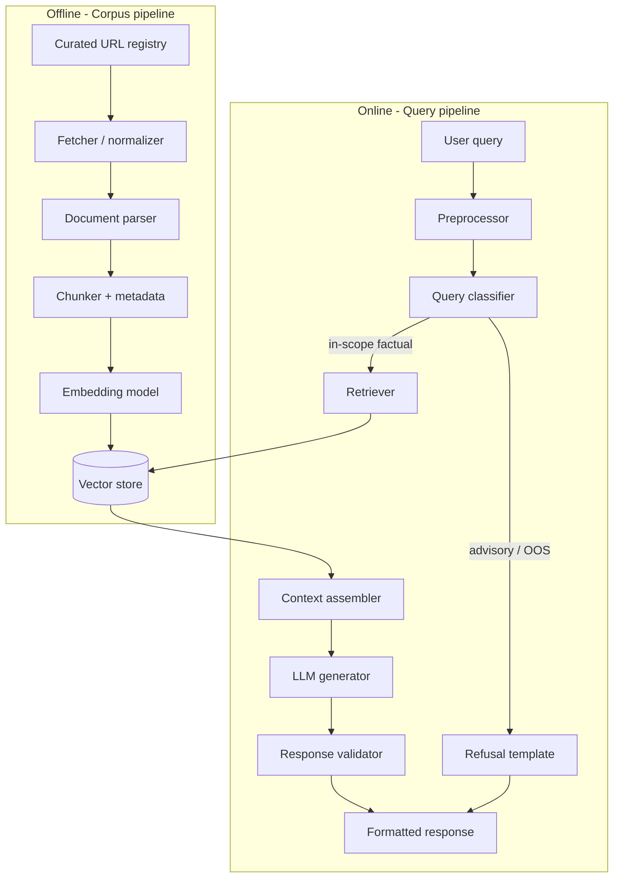
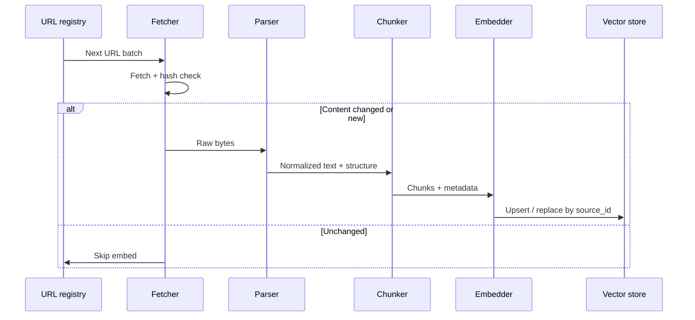
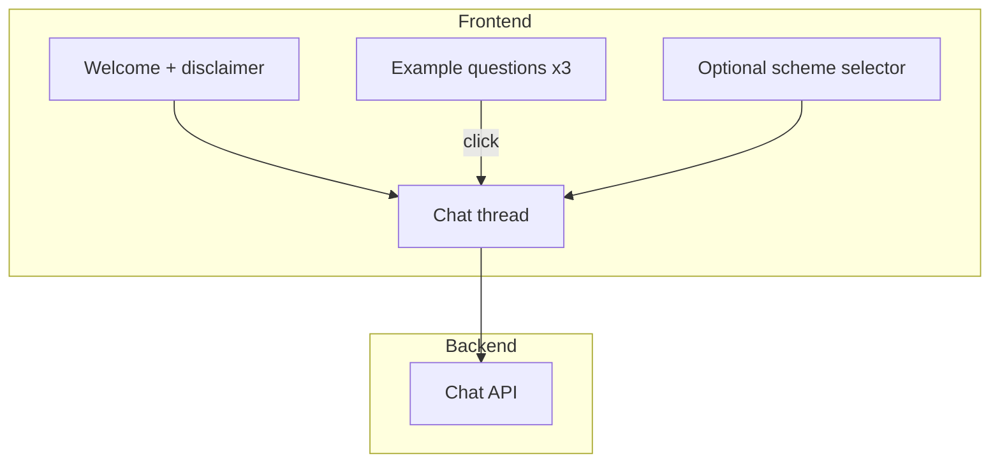
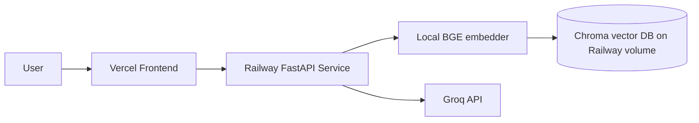
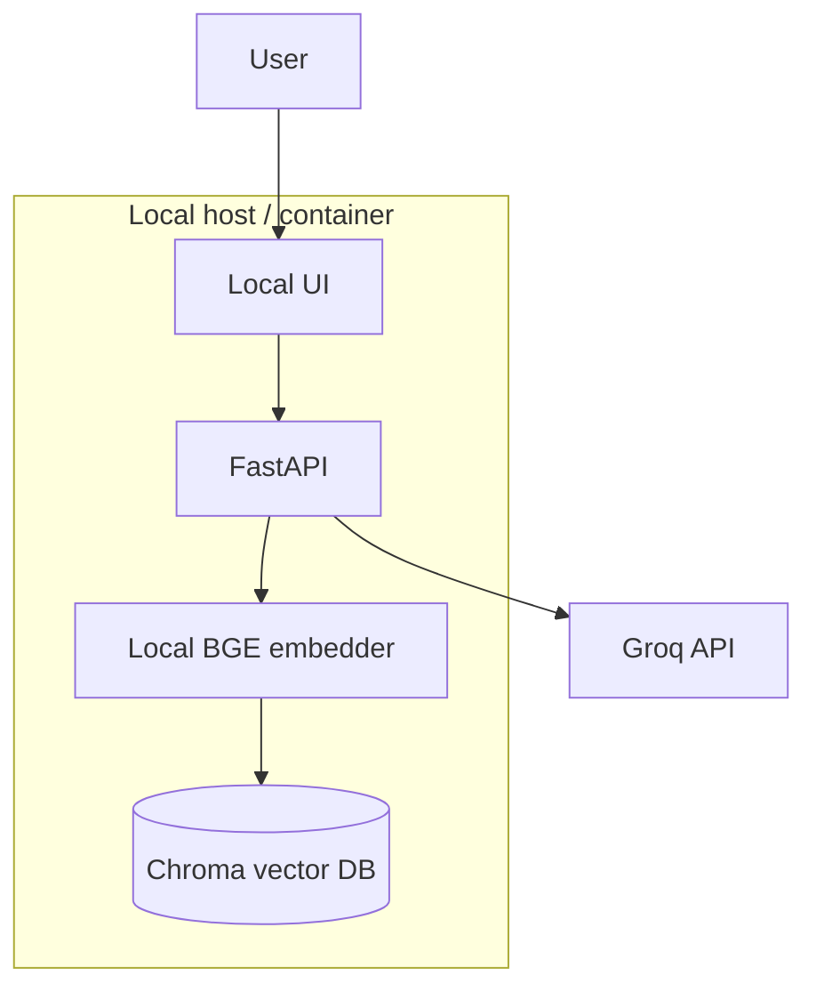

# Architecture: Mutual Fund FAQ Assistant (Facts-Only RAG)

This document describes the technical architecture for a **lightweight, compliance-first Retrieval-Augmented Generation (RAG)** system that answers factual questions about **10 ICICI Prudential direct-growth schemes**, using official public sources only. Product and UX alignment reference **Groww**; citations and retrieval do **not** use Groww as a source.

**Related documents:** [`context.md`](context.md) · [`problemstatement.txt`](problemstatement.txt) · [`edgecases.md`](edgecases.md)

---

## 1. Design principles

| Principle | Implication |
|-----------|-------------|
| **Facts over fluency** | Prefer retrieved text and structured fields over creative paraphrase. |
| **Official sources only** | Corpus and citations: ICICI Prudential AMC, AMFI, SEBI. No blogs or aggregators. |
| **Bounded scope** | Exactly 10 schemes; unknown schemes and other AMCs → refusal path. |
| **Deterministic guardrails** | Post-generation validation for sentence count, single link, footer, and advisory detection. |
| **No PII** | Stateless Q&A; no storage of PAN, Aadhaar, accounts, OTPs, email, or phone. |
| **Transparency** | Every answer: one official link + `Last updated from sources: <date>`. |

---

## 2. System context



**In scope:** Factual Q&A on the 10 schemes (expense ratio, exit load, minimum SIP, riskometer, benchmark, statement download process, **fund management disclosures**, etc.).

**Out of scope:** Investment advice, fund comparisons, return calculations, **subjective fund-manager opinions or manager-vs-manager comparisons**, schemes outside the list, other AMCs, and any user PII collection.

---

## 3. High-level architecture

The system splits into an **offline corpus pipeline** (build/update knowledge) and an **online query pipeline** (classify → retrieve → generate → validate → respond).



### 3.1 Component summary

| Component | Responsibility |
|-----------|----------------|
| **URL registry** | Canonical list of official URLs per scheme and shared regulatory pages. |
| **Fetcher** | HTTP fetch with retries, rate limits, content-type handling (HTML, PDF). |
| **Parser** | Extract clean text; preserve tables where needed (factsheets). |
| **Chunker** | Split by headings/sections; attach rich metadata (scheme, doc type, source URL, fetched date). |
| **Vector store** | Semantic search over chunks; optional metadata filters. |
| **Query classifier** | Route: factual in-scope, performance-link-only, advisory, out-of-scope scheme/AMC. |
| **Retriever** | Top-k chunks with scheme filter when scheme is detected or selected. |
| **Generator** | Groq chat LLM (`llama-3.3-70b-versatile` default) constrained by system prompt + retrieved context only. |
| **Validator** | Intent-aware sentence cap; honorific-safe splitting; strip URLs from answer body; `citation_url` for UI link; footer; no advice patterns. |
| **Web UI** | Chat, disclaimer, three example questions, no PII fields. |

---

## 4. In-scope domain model

### 4.1 AMC and schemes

**AMC:** ICICI Prudential Mutual Fund.

**Schemes (10):** Each record in the registry should include:

- `scheme_id` — stable internal key (e.g. `icici-large-cap-direct-growth`)
- `display_name` — official scheme name on AMC/Groww
- `category` — Equity / Hybrid / Debt sub-category
- `groww_slug` — optional, for UX alignment only (not citations)
- `aliases` — informal names and legacy slugs (e.g. “Multi Asset”, “Dynamic Plan”, “bank index”)

**Formal alias catalogue and resolution rules:** [`scheme-aliases.md`](scheme-aliases.md). Data: `corpus/schemes.yaml`.

| scheme_id | Display name (Direct Growth) |
|-----------|------------------------------|
| `icici-large-cap` | ICICI Prudential Large Cap Fund |
| `icici-manufacturing` | ICICI Prudential Manufacturing Fund |
| `icici-phd` | ICICI Prudential Pharma Healthcare and Diagnostics (P.H.D) Fund |
| `icici-us-bluechip` | ICICI Prudential US Bluechip Equity Fund |
| `icici-multi-asset` | ICICI Prudential Multi Asset Fund |
| `icici-nifty-auto` | ICICI Prudential Nifty Auto Index Fund |
| `icici-nifty-50` | ICICI Prudential Nifty 50 Index Fund |
| `icici-nifty-500` | ICICI Prudential Nifty 500 Index Fund |
| `icici-nifty-bank` | ICICI Prudential Nifty Bank Index Fund |
| `icici-nifty-smallcap-250` | ICICI Prudential Nifty Smallcap 250 Index Fund |

**Canonical ingest/citation URLs:** [`MF_URL.md`](MF_URL.md) only (`www.icicipruamc.com` product pages). Registry: `corpus/schemes.yaml`, manifest: `corpus/urls.yaml`.

### 4.2 Document types (corpus)

Per scheme and shared AMC/regulatory layer:

| `doc_type` | Examples | Typical content |
|------------|----------|-----------------|
| `factsheet` | Monthly factsheet PDF | Expense ratio, benchmark, riskometer, AUM, **fund manager** name/tenure |
| `kim` | Key Information Memorandum | Fees, min investment, exit load, manager disclosures where listed |
| `sid` | Scheme Information Document | Legal/objective terms, investment management details |
| `amc_scheme` | AMC scheme detail page (legacy name) | Official per-scheme manager listing, co-managers, management team |
| `amc_product_page` | AMC React product page (`MF_URL.md`) | Holdings, sectors, fund managers (tab panels + `apimf` APIs), NAV, TER, metrics |
| `amc_faq` | AMC help / FAQ | Statements, tax reports, general process |
| `amfi` | AMFI investor education | Definitions, industry guidance |
| `sebi` | SEBI circulars / investor pages | Regulatory context |

**Current corpus (production):** **10 URLs** — one `amc_product_page` per scheme from [`MF_URL.md`](MF_URL.md). Holdings, sector allocation, and fund managers are loaded from SPA tabs and `apimf.icicipruamc.com` APIs during Playwright ingest (`src/ingest/amc_spa.py`). Optional future expansion: factsheet/KIM/SID PDFs per scheme; shared AMFI/SEBI pages for refusals only.

### 4.3 Fund management (factual subdomain)

Users may ask who manages a scheme, since when, and whether co-managers or a named team are disclosed. The assistant answers only from retrieved official text.

| Allowed (factual) | Not allowed (refuse) |
|-----------------|----------------------|
| Fund manager name(s) as stated on factsheet/KIM/SID/AMC page | “Is the manager good?” / “Should I trust this manager?” |
| Management start date / tenure if explicitly disclosed | Manager skill rankings or endorsements |
| Co-manager or team listing per disclosure | Comparing managers across schemes (“who is better?”) |
| Note that index funds may state passive/index mandate vs named manager | Biographical claims not in official corpus |

**Retrieval hint:** Tag chunks with `topic: fund_management` when section headings match (“Fund Manager”, “Investment Team”, “Fund Management”).

---

## 5. Corpus pipeline (offline)

### 5.1 URL registry

Maintain a versioned manifest (e.g. `corpus/urls.yaml`):

```yaml
# Illustrative structure
schemes:
  icici-large-cap:
    display_name: "ICICI Prudential Large Cap Fund Direct Growth"
    sources:
      - url: "https://www.icicipruamc.com/..."
        doc_type: factsheet
      - url: "https://www.icicipruamc.com/..."
        doc_type: kim
      - url: "https://www.icicipruamc.com/..."
        doc_type: amc_scheme
        topic: fund_management
shared:
  - url: "https://www.amfiindia.com/..."
    doc_type: amfi
  - url: "https://www.sebi.gov.in/..."
    doc_type: sebi
```

Each entry: `url`, `doc_type`, `scheme_id` (nullable for shared), `last_fetched`, `content_hash`, `allowed_for_citation: true`.

**Exclusion rule:** Groww URLs are **not** in this manifest for ingestion or citation.

### 5.2 Ingestion flow



**Fetcher requirements:**

- Respect `robots.txt` and reasonable crawl delays.
- Store raw snapshots optionally (for audit/re-ingest), not user data.
- Record `fetched_at` and `source_last_modified` (HTTP headers or PDF metadata) for footer dates.

**AMC product pages (SPA) — `amc_product_page`:**

ICICI Prudential scheme URLs in [`MF_URL.md`](MF_URL.md) are client-rendered. Ingest path:

| Step | Component | Behavior |
|------|-----------|----------|
| 1 | `fetch_amc_product_page` | Playwright (Chromium); `domcontentloaded` + wait for `/fs/v1/funds/{fundId}/details` |
| 2 | Tab expansion | Click **Holdings**, **Fund Manager**, **Sectors** (`role=tab`); dismiss MUI backdrops before clicks |
| 3 | API capture | Listen for `apimf.icicipruamc.com` (portfolio `?type=HL` / `ST`, metrics, fund details); optional `page.request` fallback |
| 4 | Scheme code | `resolve_direct_growth_scheme_code()` — Direct + Growth `schemeCode` (differs from URL path id) |
| 5 | Parse | `amc_fund_parser.py` → sections: Top holdings, Fund Manager, Sector allocation, Fund metrics |
| 6 | Index | Chunk + embed; tag `topic=fund_management` on manager headings |

**Do not** open the Scheme Plan (Direct/Regular) menu before portfolio tabs — it leaves a backdrop that blocks tab clicks. Re-ingest all schemes: `python -m src.ingest --force`.

**Chunking strategy:**

- **HTML:** Split on `h1`–`h3`; keep lists and tables intact when they carry fee/load data.
- **PDF:** Page- or section-based chunks (~300–800 tokens) with overlap (50–100 tokens) to avoid splitting fee tables awkwardly.
- **Metadata on every chunk:** `scheme_id`, `doc_type`, `source_url`, `page_or_section`, `fetched_at`, `text_hash`, optional `topic` (e.g. `fund_management`, `fees`, `benchmark`).
- **Fund manager sections:** Prefer section-aware chunking so manager name and tenure stay in the same chunk; avoid splitting tables that pair name with “managed since” date.

### 5.3 Embeddings and index

- **Embedding model:** **[BAAI/bge-small-en-v1.5](https://huggingface.co/BAAI/bge-small-en-v1.5)** — local, English, 384-dimensional vectors via `sentence-transformers`. Chosen for factual lookup on a small official-doc corpus: no API cost, corpus text stays on-machine, and quality is sufficient for fee/load/manager keyword retrieval.
- **Provider:** `EMBEDDING_PROVIDER=local` (default). Ingest and query **must use the same model** so vectors share one embedding space.
- **Vector store:** **ChromaDB** at `data/chroma/` with metadata filtering (`scheme_id`, `doc_type`, `topic`, etc.).
- **Indexes:** Primary semantic index; optional BM25 hybrid for exact terms (“exit load”, “expense ratio”) in a later iteration.

**Ingest embedder (task 1.11):** Batch-embed chunk text; upsert by `chunk_id` / `content_hash`. Model weights cached after first Hugging Face download (~130 MB).

**Query retriever (Phase 2):** Embed user question with the same `bge-small-en-v1.5` instance; cosine similarity search in Chroma with optional metadata filters.

**Re-ingestion:** Daily scheduled ingest via GitHub Actions (10:00 IST); see [`ingest-schedule.md`](ingest-schedule.md). Manual `python -m src.ingest` when needed. Version chunks by `content_hash` to avoid stale duplicates; re-embed only when chunk text changes.

---

## 6. Query pipeline (online)

### 6.1 End-to-end flow

```mermaid
sequenceDiagram
  participant U as User
  participant UI as Web UI
  participant API as Chat API
  participant CLS as Classifier
  participant RET as Retriever
  participant LLM as Generator
  participant VAL as Validator

  U->>UI: Question
  UI->>API: POST /chat { message }
  API->>CLS: Classify query
  alt Advisory or comparison
    CLS->>API: Refusal + AMFI/SEBI link
  alt Out-of-scope scheme
    CLS->>API: Scope refusal + list in-scope funds
  alt Performance / returns
    CLS->>RET: Resolve scheme factsheet URL only
    RET->>API: Template with factsheet link
  alt Factual in-scope
    CLS->>RET: scheme_id + query embedding
    RET->>LLM: Top-k chunks + strict prompt
    LLM->>VAL: Draft answer
    alt Validation pass
      VAL->>API: Final answer
    else Validation fail
      VAL->>LLM: Repair prompt or safe fallback
    end
  end
  API->>UI: Response + disclaimer
```

### 6.2 Preprocessing

- Normalize whitespace and unicode.
- **Scheme resolution:** Match user text against `display_name`, `aliases`, `groww_slug`, and `scheme_id` (see [`scheme-aliases.md`](scheme-aliases.md)). Message text overrides UI `scheme_id` when both are present.
- If multiple schemes mentioned, ask clarifying question or answer only if unambiguous.
- **PII detection:** Regex/heuristics for PAN, Aadhaar, account numbers, email, phone — if detected, reject with a short privacy message (do not log PII).

### 6.3 Query classifier

| Class | Examples | Route |
|-------|----------|--------|
| `factual` | “What is the expense ratio of Large Cap Fund?” | Retrieve + generate |
| `factual` (fund mgmt) | “Who is the fund manager of Technology fund?” | Retrieve + generate; boost `topic=fund_management` |
| `performance` | “What was the 3Y return?” | Factsheet link only; no return numbers |
| `advisory` | “Should I invest?”, “Which is better?”, “Is the manager good?” | Refusal template |
| `out_of_scope` | Other AMC or unknown scheme | Scope refusal |
| `operational_shared` | “How to download capital gains report?” | Retrieve from `amc_faq` / shared docs |

Implementation options (combine for reliability):

1. **Rules/keywords** — fast path for advice (“should I”, “better”, “recommend”, “good manager”, “best manager”, “trust the manager”).
2. **Lightweight LLM classifier** — single label + `scheme_id` with JSON schema.

### 6.4 Retrieval

**Scheme resolution (before retrieval):** If the user message resolves to a scheme (e.g. “Nifty 500”, “bank index”), that `scheme_id` is used even when the UI sent a different `scheme_id` from the sidebar. The picker applies only when the message does not resolve. Full precedence and alias list: [`scheme-aliases.md`](scheme-aliases.md).

**Inputs:** User query embedding, optional `scheme_id` filter, optional `doc_type` / `topic` boost (e.g. prefer `kim` for exit load; prefer `amc_product_page` + `topic=fund_management` when query mentions “fund manager”, “who manages”, “investment manager”).

**Parameters (starting point):**

- `top_k = 5–8`
- Similarity threshold; if below threshold → “I don’t have verified information” + suggest factsheet link
- **Metadata filter:** `scheme_id = X OR doc_type IN (amfi, sebi, amc_faq)` for shared operational questions

**Context assembly:**

- Deduplicate overlapping chunks from same `source_url`.
- Pass source URLs and `fetched_at` to generator for citation and footer.
- Cap total context tokens to model window (prioritize highest-similarity chunks).
- For **fund-management** intent, prioritize chunks whose `section` is **Fund Manager** so manager names appear in context.

**Fund-manager fast path (optional):** When retrieved context includes a **Fund Manager** section with parsed names, `/chat` may return a deterministic answer (all names, canonical citation) without relying on the LLM (`src/retrieval/fund_manager_answer.py`).

### 6.5 Generation

**System prompt constraints (non-exhaustive):**

- Answer only from provided context; if missing, say so briefly.
- **Answer length (prose):**
  - **Default `type=answer`:** maximum **3 sentences**.
  - **Fund-management queries:** maximum **6 sentences**; list every manager name from context (comma-separated when possible).
  - **User asks for detailed / complete / full list in prose** (e.g. “list all holdings”, “give full details”): **relax the 3-sentence cap** — use a higher validator limit so lists are not truncated; still facts-only, one citation, footer.
  - **`type=structured`:** when the user explicitly asks for a **table**, **tabular** layout, or **all-funds** comparison — return a table (up to 12 rows) plus optional **2-sentence** summary; **not** limited to 3 prose sentences.
- Do **not** paste URLs in the generated answer; the API returns `citation_url` for the UI **Official source** link.
- End with: `Last updated from sources: YYYY-MM-DD` in the answer body (max date among cited chunks).
- For **fund-management** queries: use only manager names (and tenure if asked); do not add TER, SIP, or exit load unless the user asked for those facts. LLM context is limited to **Fund Manager** sections when possible (`chat._generation_context_text`).
- No advice, opinions, comparisons, or return calculations.
- For fund management: state only names, dates, and roles **explicitly present** in context; do not infer career history or performance.
- Do not cite Groww.

**User message:** Original question + assembled context block with labeled sources.

**Temperature:** Low (0–0.3) to reduce hallucination.

**Provider (Phase 2+):** [Groq](https://console.groq.com/) chat completions API (`https://api.groq.com/openai/v1`). Set `GROQ_API_KEY` in `.env`. Default model: `llama-3.3-70b-versatile` (alternatives: `llama-3.1-8b-instant` for lower latency). Embeddings remain local BGE — Groq is used for generation only.

### 6.6 Response validator (guardrails)

Run after every LLM output (and on refusal templates where applicable):

| Check | Action on failure |
|-------|-------------------|
| Sentence count (intent-aware) | Default ≤3; fund-management ≤6; detailed/tabular → structured path or higher cap — see [`context.md`](context.md) |
| Honorific-safe splitting | Do not split on `Mr.` / `Ms.` / `Mrs.` / `Dr.` when counting sentences |
| URLs in answer body | Strip all `http(s)` links from `answer`; never append URL into prose |
| Citation URL | Set `citation_url` from manifest / `preferred_citation_url()`; domain ∈ allowlist |
| Footer matches `Last updated from sources: <date>` | Append from chunk metadata |
| Advisory phrases detected | Replace with refusal template |
| Subjective manager phrases (“best manager”, “good manager”, “trust”) | Replace with refusal template |
| Return/% figures in performance class | Replace with factsheet-only template |

**Allowlist example domains:** `icicipruamc.com`, `amfiindia.com`, `sebi.gov.in` (configure per deployed registry).

### 6.7 Refusal templates

**Advisory:**

- Polite decline, facts-only policy, one educational link (AMFI or SEBI investor page).

**Out-of-scope scheme:**

- State coverage limited to 10 ICICI Prudential schemes; optionally name categories; no comparison.

**Performance:**

- One sentence: cannot provide return comparisons; link to **official factsheet** for that scheme; footer date.

All refusals remain ≤ 3 sentences where possible; the official link is in `citation_url` only (not embedded in the refusal text).

---

## 7. API and UI architecture

### 7.1 API surface (minimal)

| Endpoint | Method | Purpose |
|----------|--------|---------|
| `/health` | GET | Liveness |
| `/chat` | POST | `{ "message", "scheme_id?" }` → `{ "answer", "citation_url", "last_updated", "type": "answer" \| "refusal" \| "structured", "structured?" }` |

**`type=structured`:** Returned when the user explicitly asks for a **table/tabular** layout or an **all-funds** list. Includes `structured: { format: "table", columns, rows, summary? }`. Standard factual Q&A remains `type=answer` with the **3-sentence** default cap unless the query is fund-management, **detailed**, or **complete-list** prose (relaxed cap per policy in [`context.md`](context.md)).

**Stateless:** No session store of user content; optional ephemeral in-memory only for request duration.

**Rate limiting:** Per IP / API key to reduce abuse; no authentication required for MVP unless deployed publicly.

### 7.2 Web UI (minimal)

Aligned with [`context.md`](context.md):

- **Welcome message** — facts-only assistant for 10 ICICI Prudential schemes.
- **Disclaimer** — visible at all times: “Facts-only. No investment advice.”
- **Three example questions** — e.g. expense ratio (Large Cap), exit load (Multi Asset), fund manager (Technology fund) or minimum SIP (Nifty 50 Index).
- **Chat input** — no fields for email, phone, PAN, or account numbers.
- **Optional scheme picker** — hint for `scheme_id` when the message does not name a scheme; **question text overrides** picker when both are present (see §6.4).
- **Answer rendering** — `answer` body is prose only (`answerBody()` strips footer and any stray URLs). **`citation_url`** drives the **Official source** link in the message footer; raw URLs are not shown in the bubble.



**Groww as reference:** Typography and information hierarchy can mirror Groww fund pages; data displayed in answers must come from official sources only.

---

## 8. Data architecture

### 8.1 Storage layout (recommended)

```
MF_RAG_ChatBot/
├── corpus/
│   ├── urls.yaml              # Official URL registry
│   ├── raw/                   # Optional fetched snapshots
│   └── manifests/             # Per-ingest run logs
├── data/
│   └── chroma/                # Vector DB persistence (example)
├── src/
│   ├── ingest/
│   ├── retrieval/
│   ├── guardrails/
│   └── api/
└── docs/
    ├── context.md
    └── architecture.md
```

### 8.2 Chunk metadata schema

```json
{
  "chunk_id": "uuid",
  "scheme_id": "icici-large-cap",
  "doc_type": "kim",
  "source_url": "https://www.icicipruamc.com/...",
  "source_title": "KIM - ICICI Prudential Large Cap Fund",
  "section": "Fund Manager",
  "topic": "fund_management",
  "embedding_model": "BAAI/bge-small-en-v1.5",
  "fetched_at": "2026-05-31T00:00:00Z",
  "content_hash": "sha256:...",
  "text": "..."
}
```

### 8.3 Citation selection

The API returns **one** citation per response in `citation_url` (not in the `answer` string). Selection policy (`src/retrieval/citations.py`):

1. Prefer **`factsheet_canonical`** AMC product URL from `corpus/urls.yaml` for the resolved `scheme_id`.
2. Reject non-public URLs (`chrome-extension://`, etc.) and legacy `digitalfactsheet` PDF links.
3. If answer synthesizes multiple chunks from the same scheme page, use that scheme’s canonical AMC URL.
4. For performance queries, use canonical AMC product URL from registry (not retrieved narrative).

---

## 9. Security, privacy, and compliance

| Area | Design |
|------|--------|
| **PII** | No collection, logging, or persistence of PAN, Aadhaar, accounts, OTPs, email, phone. |
| **Input logging** | Redact or disable query logging in production; if logs needed, strip PII patterns first. |
| **Secrets** | `GROQ_API_KEY` and other secrets via environment variables only (`.env`, not committed). |
| **Network** | HTTPS for UI and API; outbound allowlist to AMC/AMFI/SEBI during ingest. |
| **Content safety** | Advisory/comparison blocked by classifier + validator. |
| **Audit** | Corpus version + `content_hash` per source for reproducibility. |

---

## 10. Deployment topology

**Recommended hosted topology (Railway + Vercel):**



**Runtime responsibilities:**

- **Vercel (frontend):**
  - Hosts UI (recommended: Next.js or static app).
  - Uses env var for backend endpoint (e.g. `NEXT_PUBLIC_API_BASE_URL=https://<railway-service>.up.railway.app`).
  - Supports Preview + Production deployments for QA.
- **Railway (backend):**
  - Runs FastAPI service and retrieval pipeline.
  - Stores Chroma data on mounted persistent volume (`data/chroma/`).
  - Holds secrets (`GROQ_API_KEY`, model/env settings) in Railway variables.
  - Exposes `/health` and `/chat` over HTTPS.

**CORS and security for split deployment:**

- Allow only frontend origins in backend CORS:
  - `https://<project>.vercel.app`
  - Preview patterns as needed
  - Custom production domain
- Keep `GROQ_API_KEY` only on Railway; never expose it to frontend.

**Alternative local/dev topology (single node):**



**Production considerations:**

- **API** service runs `uvicorn` only (no backend cron).
- Persistent volume for vector index (`data/chroma/`).
- **Scheduled corpus refresh:** GitHub Actions [`.github/workflows/daily-ingest.yml`](../.github/workflows/daily-ingest.yml) at 10:00 IST — not a Railway cron on the API.
- Monitor Railway cold starts/CPU limits; keep retrieval latency budgets in mind.

Environment variables: `GROQ_API_KEY`, `LLM_MODEL` (default `llama-3.3-70b-versatile`), `LLM_BASE_URL` (default `https://api.groq.com/openai/v1`), `EMBEDDING_MODEL` (default `BAAI/bge-small-en-v1.5`), `EMBEDDING_DEVICE`, `VECTOR_DB_PATH`, `ALLOWED_DOMAINS`, `CORPUS_URLS_PATH`.

---

## 11. Technology recommendations

Stack is intentionally **lightweight** and swappable:

| Layer | Options |
|-------|---------|
| Language | Python 3.11+ |
| API | FastAPI |
| UI | Vercel-hosted frontend (recommended: Next.js) |
| Parsing | `beautifulsoup4`, `pypdf` or `pdfplumber` |
| Embeddings | **BAAI/bge-small-en-v1.5** via `sentence-transformers` (local; default) |
| Vector DB | Chroma (local), FAISS, or pgvector |
| LLM | **[Groq](https://groq.com/)** — default `llama-3.3-70b-versatile` via OpenAI-compatible API; low temperature (0–0.1); free tier |
| Orchestration | LangChain or LlamaIndex (optional) or thin custom wrappers |

Choose components to minimize ops burden for a portfolio/demo project.

---

## 12. Observability and maintenance

| Metric | Purpose |
|--------|---------|
| Retrieval hit rate | Chunks above similarity threshold |
| Refusal rate by class | Tune classifier |
| Validator failure rate | Prompt or retrieval gaps |
| Corpus staleness | Age vs. `fetched_at` |
| Latency p95 | UX |

**Corpus maintenance:**

1. Update `urls.yaml` when AMC publishes new factsheets.
2. Run ingest; verify `content_hash` changes.
3. Spot-check answers for each scheme (expense ratio, exit load, min SIP, fund manager where disclosed).
4. Refresh `Last updated from sources` footer logic from latest `fetched_at`.

---

## 13. Known limitations

- **Coverage:** Only 10 schemes; no dynamic discovery of new ICICI funds.
- **Stale data:** Answers reflect last ingest; factsheets may lag AMC site by days.
- **PDF/HTML variance:** Parser quality affects retrieval for complex tables.
- **Ambiguous scheme names:** User must disambiguate similar index funds (Nifty 50 vs Next 50).
- **Manager changes:** Factsheet date may lag a recent manager change until corpus re-ingest.
- **Index / passive schemes:** Disclosure may describe index mandate rather than an active manager; answer must reflect source wording.
- **No personalization:** No portfolio or account-aware answers.
- **English only:** Unless corpus includes localized AMC pages.
- **Groww drift:** Product names/slugs on Groww may change; update `corpus/schemes.yaml` and [`scheme-aliases.md`](scheme-aliases.md).

---

## 14. Success criteria mapping

| Criterion ([`context.md`](context.md)) | Architectural mechanism |
|----------------------------------------|-------------------------|
| Accurate factual retrieval | Official corpus + hybrid retrieval + low-temperature Groq LLM |
| Facts-only responses | Classifier + system prompt + validator |
| Fund management disclosures | Corpus `topic=fund_management` + retrieval boost + no-opinion prompts |
| Valid single citation | Validator allowlist + citation policy |
| Advisory refusal | Classifier + phrase detection + templates |
| Minimal UI | Vercel frontend chat + disclaimer + 3 examples, integrated with Railway `/chat` |

---

## 15. Implementation phases

Detailed task breakdown, acceptance criteria, and test plans: [`implementation.md`](implementation.md).

| Phase | Deliverable |
|-------|-------------|
| **P0** | URL registry for 10 schemes + shared AMFI/SEBI; ingest factsheets/KIM |
| **P1** | Vector index + `/chat` API + factual path + validator |
| **P2** | Classifier (advisory, OOS, performance) + refusal templates |
| **P3** | Minimal UI + example questions + disclaimer |
| **P5** | Daily re-ingest (GitHub Actions) + monitoring + README — [`ingest-schedule.md`](ingest-schedule.md) |

---

## 16. Example question flows

**Factual (in-scope):**

> User: “What is the minimum SIP for ICICI Prudential Nifty 50 Index Direct Plan?”

1. Resolve `scheme_id = icici-nifty-50`
2. Classify `factual`
3. Retrieve from `kim` / `factsheet` with scheme filter
4. Generate ≤3 sentences + one AMC URL + footer date
5. Validator pass → response

**Advisory:**

> User: “Should I invest in Technology fund or Pharma fund?”

1. Classify `advisory` (comparison + advice)
2. Return refusal + AMFI educational link (no retrieval)

**Performance:**

> User: “What was the 5-year return of Large Cap Fund?”

1. Classify `performance`
2. Skip return calculation; return factsheet URL from registry + footer

**Fund management (factual):**

> User: “Who manages ICICI Prudential Flexicap Fund and since when?”

1. Resolve `scheme_id = icici-flexicap`
2. Classify `factual` (fund management)
3. Retrieve with `scheme_id` filter + boost `topic=fund_management` / `doc_type` in (`factsheet`, `amc_scheme`, `kim`)
4. Generate manager name and tenure only if present in chunks; cite factsheet or AMC scheme URL
5. Validator pass (no subjective manager language) → response

**Fund management (advisory — refuse):**

> User: “Is the Pharma fund manager better than the Technology fund manager?”

1. Classify `advisory` (comparison + subjective)
2. Return refusal + AMFI/SEBI educational link (no retrieval)

---

*This architecture is derived from [`context.md`](context.md) and the project problem statement. Update this document when scheme scope, corpus URLs, or compliance rules change.*
