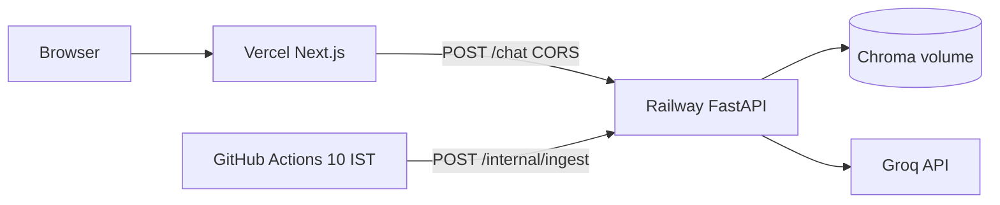

# Deployment: Railway (API) + Vercel (UI)

**Checklist version:** [Deployment-plan.md](Deployment-plan.md) — step-by-step sign-off for Railway + Vercel.

Phase 4 production split: FastAPI on **Railway**, Next.js chat UI on **Vercel**.

## Architecture



## 1. Railway (backend)

Ingest on API volume + 10:00 IST refresh: **[ingest-schedule.md](ingest-schedule.md)** (GitHub Actions) · **[railway-ingest.md](railway-ingest.md)** (API setup, optional Railway cron).

### API service setup

1. Create a [Railway](https://railway.app/) project and connect this repository.
2. Set the **root directory** to the repo root (not `frontend/`).
3. **Config file:** `railway.toml` (or Procfile / start command below).
4. **Start command:**

   ```bash
   uvicorn src.main:app --host :: --port $PORT
   ```

5. **Health check path:** `/health`

### API environment variables

| Variable | Required | Notes |
|----------|----------|-------|
| `GROQ_API_KEY` | Yes | [console.groq.com/keys](https://console.groq.com/keys) |
| `LLM_MODEL` | No | Default `llama-3.3-70b-versatile` |
| `VECTOR_DB_PATH` | Yes | `data/chroma` on mounted volume |
| `CORS_ORIGINS` | Yes | All Vercel origins + `http://localhost:3000` |
| `ENABLE_INTERNAL_INGEST` | Yes (prod) | `true` — allows cron to trigger ingest |
| `INGEST_TRIGGER_SECRET` | Yes (prod) | Shared secret with cron service |
| `ALLOWED_DOMAINS` | No | See `.env.example` |

**CORS example** (replace with your Vercel URLs):

```bash
CORS_ORIGINS=https://mf-rag-chatbot.vercel.app,https://mf-rag-chatbot-git-main-you.vercel.app,http://localhost:3000
```

After each new Vercel preview domain that must call the API, add that exact origin to `CORS_ORIGINS` and redeploy Railway.

### Persistent storage (API service only)

1. Add a **Volume** mounted at `/app/data`.
2. Set `VECTOR_DB_PATH=data/chroma`.
3. **Bootstrap** once (shell):

   ```bash
   python -m src.ingest --manifest corpus/urls.yaml --no-save-raw
   ```

### Daily refresh (10:00 AM IST)

**Default:** GitHub Actions → `POST /internal/ingest` on this API. Set repo secrets `RAILWAY_API_BASE_URL` and `INGEST_TRIGGER_SECRET` (see [ingest-schedule.md](ingest-schedule.md)).

**Optional:** Second Railway service with `railway.ingest.toml` instead of GitHub schedule — [railway-ingest.md](railway-ingest.md) Option B.

### Verify

```bash
curl https://<your-service>.up.railway.app/health
curl https://<your-service>.up.railway.app/corpus-status
```

## 2. Vercel (frontend)

### Project setup

1. Import the repo in [Vercel](https://vercel.com/).
2. Set **Root Directory** to `frontend`.
3. **Framework preset:** Next.js (auto-detected).
4. **Build command:** `npm run build` (default)
5. **Output:** Next.js default

### Environment variables

| Variable | Environments | Example |
|----------|--------------|---------|
| `NEXT_PUBLIC_API_BASE_URL` | Production, Preview | `https://<railway-service>.up.railway.app` |
| `NEXT_PUBLIC_APP_NAME` | Optional | `MF Facts Assistant` |

No trailing slash on `NEXT_PUBLIC_API_BASE_URL`.

### Verify end-to-end

1. Open the Vercel deployment URL.
2. Confirm the amber disclaimer is visible at the top.
3. Click an example question → Network tab shows `POST …/chat` → 200.
4. Factual answer: green user bubble, white assistant card, **Official source** link, footer date.
5. Ask “Should I invest?” → amber refusal card with educational link.

### CORS troubleshooting

| Symptom | Fix |
|---------|-----|
| Browser: blocked by CORS | Add exact page origin to Railway `CORS_ORIGINS` |
| Network failed / API unreachable | Check Railway URL in Vercel env; confirm `/health` |
| 502 from Railway | Check logs; ensure Chroma path exists after volume mount |

## 3. Local full-stack

| Service | Command | URL |
|---------|---------|-----|
| API | `uvicorn src.main:app --reload` | http://127.0.0.1:8000 |
| UI | `cd frontend && npm run dev` | http://localhost:3000 |

`frontend/.env.local`:

```bash
NEXT_PUBLIC_API_BASE_URL=http://127.0.0.1:8000
```

Root `.env` should include `CORS_ORIGINS=…localhost:3000…` (default in `.env.example`).

## 4. UI behavior (Phase 4)

| Feature | Behavior |
|---------|----------|
| Disclaimer | Sticky top banner; always visible |
| Example questions | Click → sets scheme, fills text, **sends immediately** |
| Scheme selector | Optional; sends `scheme_id` when the message does not name a fund. Message aliases override picker ([`scheme-aliases.md`](scheme-aliases.md)) |
| Refusals | Amber card + reason label; citation when provided |
| PII block | Same refusal styling; `refusal_reason: pii` |
| Citations | Single link, `target="_blank"`, `rel="noopener noreferrer"` |
