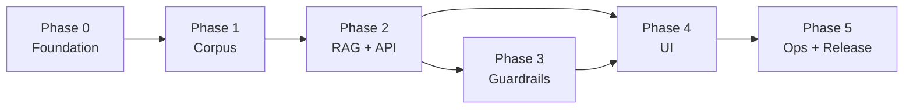

# Implementation Plan: Mutual Fund FAQ Assistant

Phase-wise plan to build the **facts-only RAG** assistant for **10 ICICI Prudential direct-growth schemes**, derived from `[context.md](context.md)` and `[architecture.md](architecture.md)`.

**Related documents:** `[problemstatement.txt](problemstatement.txt)` · `[architecture.md](architecture.md)` · `[context.md](context.md)` · `[scheme-aliases.md](scheme-aliases.md)`

---

## 1. Plan overview

### 1.1 Goal

Deliver a compliant FAQ chatbot that:

- Answers factual questions (fees, loads, minimums, riskometer, benchmark, operations, **fund management**)
- Cites **one official URL** per answer (AMC, AMFI, SEBI only)
- Refuses advice, comparisons, performance math, and out-of-scope schemes
- Exposes a minimal UI with disclaimer and three example questions

### 1.2 Phase map




| Phase | Name                 | Primary outcome                                   | Est. effort |
| ----- | -------------------- | ------------------------------------------------- | ----------- |
| **0** | Foundation           | Repo, config, scheme registry, dev workflow       | 2–3 days    |
| **1** | Corpus & ingest      | Official URLs ingested, vector index v1           | 5–7 days    |
| **2** | RAG core & API       | `/chat` answers in-scope factual queries          | 5–7 days    |
| **3** | Guardrails & routing | Classifier, refusals, performance path, validator | 4–5 days    |
| **4** | UI & UX              | Minimal chat UI, disclaimer, examples             | 3–4 days    |
| **5** | Ops & release        | Re-ingest, monitoring, README, evaluation         | Complete    |


*Estimates assume one developer familiar with Python/RAG; adjust for team size.*

### 1.3 Recommended repository layout (end state)

```
MF_RAG_ChatBot/
├── corpus/
│   ├── urls.yaml
│   ├── schemes.yaml
│   ├── raw/
│   └── manifests/
├── data/
│   └── chroma/
├── src/
│   ├── ingest/
│   ├── retrieval/
│   ├── guardrails/
│   ├── api/
│   └── ui/
├── tests/
│   ├── unit/
│   ├── integration/
│   └── eval/
├── docs/
├── .env.example
├── requirements.txt
└── README.md
```

---

## 2. Cross-cutting requirements (all phases)

These apply from Phase 1 onward and must not be deferred to “later” without explicit risk acceptance.


| Requirement                    | Implementation checkpoint                                              |
| ------------------------------ | ---------------------------------------------------------------------- |
| Official sources only          | `urls.yaml` allowlist; validator domain check                          |
| 10-scheme scope                | `schemes.yaml` + retrieval `scheme_id` filter                          |
| 3-sentence cap                 | Validator in Phase 2+                                                  |
| Single citation                | Validator URL count + allowlist                                        |
| Footer date                    | `Last updated from sources: <date>` from chunk `fetched_at`            |
| No PII                         | No PII fields in UI; PII regex block on input                          |
| No Groww citations             | Groww URLs excluded from `urls.yaml`                                   |
| Fund management (factual only) | `topic=fund_management` chunks; refusal for subjective manager queries |
| Disclaimer                     | UI + README: “Facts-only. No investment advice.”                       |


---

## 3. Phase 0 — Foundation

### 3.1 Objectives

- Bootstrap the codebase and configuration model
- Freeze scheme registry (10 funds) and naming aliases
- Enable local development without corpus data

### 3.2 Prerequisites

- Python 3.11+
- API keys for embedding + LLM (document in `.env.example`, not committed)

### 3.3 Tasks


| #   | Task                    | Details                                                                                                                                             |
| --- | ----------------------- | --------------------------------------------------------------------------------------------------------------------------------------------------- |
| 0.1 | Initialize project      | `requirements.txt` / `pyproject.toml`: FastAPI, httpx, beautifulsoup4, pypdf or pdfplumber, chromadb (or chosen vector DB), pydantic, python-dotenv |
| 0.2 | Environment template    | `.env.example`: `LLM_API_KEY`, `EMBEDDING_API_KEY`, `ALLOWED_DOMAINS`, paths for corpus/index                                                       |
| 0.3 | Scheme registry         | `corpus/schemes.yaml`: all 10 `scheme_id`, `display_name`, `category`, `groww_slug`, `aliases` (incl. Multi Asset / Dynamic Plan slug). Documented in [`scheme-aliases.md`](scheme-aliases.md) |
| 0.4 | Domain allowlist config | `icicipruamc.com`, `amfiindia.com`, `sebi.gov.in` (+ subdomains as needed)                                                                          |
| 0.5 | Logging baseline        | Structured logs; **no** raw user PII in logs; log level via env                                                                                     |
| 0.6 | Health endpoint stub    | `GET /health` returning `{ "status": "ok" }`                                                                                                        |
| 0.7 | Docs index              | README links to `context.md`, `architecture.md`, `implementation.md`, `scheme-aliases.md`                                                       |


### 3.4 Deliverables

- Runnable empty FastAPI app
- `corpus/schemes.yaml` with 10 schemes
- `.env.example` and `.gitignore` (exclude `.env`, `data/`, `corpus/raw/`)

### 3.5 Acceptance criteria

- `uvicorn` / equivalent starts API locally
- Scheme registry loads and resolves aliases (unit tests in `tests/test_scheme_registry.py`; catalogue in [`scheme-aliases.md`](scheme-aliases.md))
- No secrets in repository

### 3.6 Tests

- Unit: scheme name → `scheme_id` resolution (10 schemes; informal aliases per [`scheme-aliases.md`](scheme-aliases.md))

---

## 4. Phase 1 — Corpus & ingest pipeline

### 4.1 Objectives

- Curate **15–25 official URLs** across 10 schemes + shared AMFI/SEBI/AMC pages
- Ingest factsheets, KIM, SID, AMC scheme pages (incl. fund manager sections)
- Produce versioned vector index v1

### 4.2 Prerequisites

- Phase 0 complete
- Manual URL research on [ICICI Prudential AMC](https://www.icicipruamc.com/) (not Groww for ingest)

### 4.3 URL registry tasks


| #   | Task                      | Details                                                                                                |
| --- | ------------------------- | ------------------------------------------------------------------------------------------------------ |
| 1.1 | Create `corpus/urls.yaml` | Per scheme: `factsheet`, `kim`, `sid`, `amc_scheme` where available; shared: `amfi`, `sebi`, `amc_faq` |
| 1.2 | Corpus coverage matrix    | Spreadsheet or markdown table: scheme × doc_type filled/not filled                                     |
| 1.3 | Factsheet canonical URLs  | One factsheet URL per scheme for performance-query fallback                                            |
| 1.4 | Fund management coverage  | Verify at least one source per scheme has “Fund Manager” (or index mandate) text                       |
| 1.5 | Manifest schema           | `url`, `doc_type`, `scheme_id`, `topic`, `allowed_for_citation: true`                                  |


**Target minimum per scheme (prioritize):**

1. Latest monthly **factsheet** (PDF)
2. **KIM** or **SID** (PDF/HTML)
3. **AMC scheme page** (`amc_scheme`) if separate from factsheet

**Shared (once):**

- AMFI investor education URL (refusal / educational link)
- SEBI investor awareness URL
- AMC FAQ for statements / capital gains download

### 4.4 Ingest pipeline tasks


| #    | Task                    | Details                                                                                                              |
| ---- | ----------------------- | -------------------------------------------------------------------------------------------------------------------- |
| 1.6  | Fetcher                 | HTTP GET with retries, timeout, rate limit; store `fetched_at`, `content_hash`, optional raw under `corpus/raw/`     |
| 1.7  | PDF parser              | Extract text; preserve tables for expense ratio, exit load, manager name/tenure                                      |
| 1.8  | HTML parser             | AMC scheme pages; strip nav/footer noise                                                                             |
| 1.9  | Chunker                 | Section-based splits; metadata: `scheme_id`, `doc_type`, `source_url`, `section`, `topic`, `fetched_at`, `text_hash` |
| 1.10 | Topic tagging           | Set `topic: fund_management` for headings matching Fund Manager / Investment Team                                    |
| 1.11 | Embedder                | Batch embed chunks; idempotent upsert by `chunk_id` or `content_hash`                                                |
| 1.12 | Vector store            | Persist under `data/chroma/` (or chosen backend)                                                                     |
| 1.13 | CLI: `ingest`           | `python -m src.ingest --manifest corpus/urls.yaml` with run log in `corpus/manifests/`                               |
| 1.14 | CLI: `ingest --dry-run` | Fetch + parse only; report chunk counts per scheme                                                                   |


### 4.5 Deliverables

- `corpus/urls.yaml` (15–25 URLs)
- Ingest module (`src/ingest/`)
- Populated vector index
- Ingest manifest JSON (per run: URLs processed, chunks created, errors)

### 4.6 Acceptance criteria

- ≥ 80% of schemes have factsheet + KIM or SID ingested
- Every scheme has ≥ 1 chunk with `topic=fund_management` **or** documented “index/passive mandate only” in corpus matrix
- Retrieval smoke test: query “expense ratio” per scheme returns ≥ 1 chunk above similarity threshold
- Retrieval smoke test: “fund manager” for Flexicap returns manager-related chunk when disclosed
- All chunk `source_url` domains ∈ allowlist

### 4.7 Tests


| Test                                  | Type        |
| ------------------------------------- | ----------- |
| Fetcher handles PDF + HTML            | Unit        |
| Chunk metadata required fields        | Unit        |
| Fund management section → `topic` tag | Unit        |
| End-to-end ingest on 2 sample URLs    | Integration |
| Chunk count per scheme report         | Integration |


### 4.8 Risks & mitigations


| Risk                           | Mitigation                                           |
| ------------------------------ | ---------------------------------------------------- |
| AMC PDF layout changes         | Section regex + manual spot-check per ingest         |
| Missing manager on index funds | Answer from mandate text; note in corpus matrix      |
| URL rot                        | Manifest versioned; failed fetch flagged in manifest |


---

## 5. Phase 2 — RAG core & chat API

### 5.1 Objectives

- Implement retrieve → generate → validate for **factual in-scope** queries
- Expose `POST /chat` with structured response
- No classifier yet (assume good-faith factual queries or manual scheme_id)

### 5.2 Prerequisites

- Phase 1 vector index available locally

### 5.3 Tasks


| #    | Task                    | Details                                                                                                             |
| ---- | ----------------------- | ------------------------------------------------------------------------------------------------------------------- |
| 2.1  | Preprocessor            | Normalize query; `resolve_scheme_id` — message aliases beat UI `scheme_id` (see [`scheme-aliases.md`](scheme-aliases.md)) |
| 2.2  | Retriever               | Embedding search, `top_k=5–8`, filter by `scheme_id` when resolved                                                  |
| 2.3  | Topic / doc_type boost  | If query matches fee/load/SIP keywords → boost `kim`/`factsheet`; if “fund manager” → boost `topic=fund_management` |
| 2.4  | Context assembler       | Dedupe by `source_url`; cap tokens; pass `fetched_at` to generator                                                  |
| 2.5  | System prompt           | Facts-only; context-only; ≤3 sentences; one URL; footer; no Groww; fund mgmt = disclosed fields only                |
| 2.6  | LLM client              | Low temperature (0–0.3); configurable model via env                                                                 |
| 2.7  | Response validator v1   | Sentence count ≤3; exactly one http(s) URL; domain allowlist; append footer if missing                              |
| 2.8  | `POST /chat`            | Request: `{ "message", "scheme_id"? }`; Response: `{ "answer", "citation_url", "last_updated", "type": "answer" }`  |
| 2.9  | Low-confidence fallback | If retrieval below threshold → short message + factsheet URL from registry                                          |
| 2.10 | PII input guard         | Reject PAN/Aadhaar/account/email/phone patterns with privacy message                                                |


### 5.4 Deliverables

- `src/retrieval/`, `src/guardrails/validator.py`, `src/api/`
- Working `/chat` for factual queries
- Prompt templates under `src/` or `config/prompts/`

### 5.5 Acceptance criteria

Manual or scripted checks for **each of 3 pilot schemes** (Large Cap, Nifty 50, Flexicap):


| Query type      | Example                            | Expected                                        |
| --------------- | ---------------------------------- | ----------------------------------------------- |
| Fees            | “Expense ratio of Large Cap Fund?” | Correct ratio or “not found”; 1 AMC URL; footer |
| Min investment  | “Minimum SIP for Nifty 50 Index?”  | Factual answer from KIM/factsheet               |
| Fund management | “Who manages Flexicap Fund?”       | Name/tenure if in corpus; no opinion            |
| Validator       | Force 4-sentence LLM output        | Truncated or regenerated to ≤3                  |


### 5.6 Tests

- Unit: validator (sentence count, URL count, domain allowlist, footer)
- Unit: retriever metadata filter
- Integration: `/chat` with mocked LLM returning fixed text
- Integration: `/chat` end-to-end with real index (golden questions file)

**Golden questions file (start):** `tests/eval/golden_factual.yaml` — 20–30 questions across fee, load, SIP, benchmark, fund manager.

**Edge cases:** Full catalog in `[edgecases.md](edgecases.md)`; recommended `tests/eval/golden_edgecases.yaml` for P0 scenarios.

---

## 6. Phase 3 — Guardrails, classifier & refusals

### 6.1 Objectives

- Route queries before retrieval: factual, performance, advisory, out-of-scope
- Template-based refusals with AMFI/SEBI educational links
- Harden validator for advisory and subjective manager language

### 6.2 Prerequisites

- Phase 2 `/chat` working

### 6.3 Tasks


| #    | Task                          | Details                                                                       |
| ---- | ----------------------------- | ----------------------------------------------------------------------------- |
| 3.1  | Rule-based classifier v1      | Keywords: should I, recommend, better, which fund, good manager, best manager |
| 3.2  | Classifier labels             | `factual`, `performance`, `advisory`, `out_of_scope`, `operational_shared`    |
| 3.3  | Out-of-scope scheme detection | Unknown scheme name → refusal listing 10-scheme coverage                      |
| 3.4  | Performance path              | No return numbers; factsheet URL from registry + footer                       |
| 3.5  | Advisory refusal template     | Polite; facts-only; one AMFI or SEBI link                                     |
| 3.6  | OOS refusal template          | Scope message; no comparison                                                  |
| 3.7  | Manager comparison refusal    | “Is X manager better than Y?” → advisory template                             |
| 3.8  | Validator v2                  | Subjective manager phrases; block return % in non-performance handler         |
| 3.9  | Optional LLM classifier       | JSON label + `scheme_id` for ambiguous queries (feature flag)                 |
| 3.10 | Wire classifier in `/chat`    | Branch before retriever                                                       |


### 6.4 Deliverables

- `src/guardrails/classifier.py`
- `src/guardrails/templates.py`
- Updated `/chat` with `type: "refusal"` and `refusal_reason`

### 6.5 Acceptance criteria


| Input                                      | Expected route                                      |
| ------------------------------------------ | --------------------------------------------------- |
| “Should I invest in Technology fund?”      | `advisory` refusal, no retrieval                    |
| “Which is better, Large Cap or Flexicap?”  | `advisory` refusal                                  |
| “Is the Pharma fund manager good?”         | `advisory` refusal                                  |
| “What was 5Y return of Large Cap?”         | `performance`; factsheet link only                  |
| “HDFC Top 100 expense ratio?”              | `out_of_scope`                                      |
| “How to download capital gains statement?” | `operational_shared` or `factual` with AMC/AMFI doc |


### 6.6 Tests

- Unit: classifier keyword coverage (≥ 15 cases)
- Unit: refusal templates include exactly one allowlisted URL
- Integration: `/chat` refusal paths never call retriever (mock assert)
- Eval: `tests/eval/golden_refusals.yaml`

---

## 7. Phase 4 — UI & end-to-end UX

### 7.1 Objectives

- Minimal Groww-inspired chat UI (reference only)
- Disclaimer always visible; three example questions
- Optional scheme picker bound to `scheme_id`

### 7.2 Prerequisites

- Phase 2 API deployed locally; Phase 3 classifier recommended before public demo

### 7.3 Tasks


| #    | Task                   | Details                                                                            |
| ---- | ---------------------- | ---------------------------------------------------------------------------------- |
| 4.1  | UI shell               | Static HTML + JS, or Streamlit for internal demo                                   |
| 4.2  | Welcome copy           | Facts-only assistant; 10 ICICI Prudential schemes                                  |
| 4.3  | Disclaimer banner      | “Facts-only. No investment advice.” — persistent                                   |
| 4.4  | Example questions (×3) | e.g. expense ratio (Large Cap); exit load (Multi Asset); fund manager (Technology) |
| 4.5  | Chat thread            | User message → `POST /chat` → render answer + citation link + footer               |
| 4.6  | Scheme selector        | Dropdown of 10 schemes → passes `scheme_id` when message does not resolve (see [`scheme-aliases.md`](scheme-aliases.md)) |
| 4.7  | Citation display       | Single clickable official link (open in new tab)                                   |
| 4.8  | Error states           | API down, PII blocked, refusal styling distinct from factual answer                |
| 4.9  | CORS / API base URL    | Env-based API URL for local vs deployed                                            |
| 4.10 | No PII inputs          | No email/phone/PAN fields; chat only                                               |


### 7.4 Deliverables

- `src/ui/` or `frontend/` served by FastAPI static mount
- Screenshots for README (optional)

### 7.5 Acceptance criteria

- Disclaimer visible without scrolling on desktop
- Example question click fills input and sends (or fills only — document behavior)
- Factual answer shows citation + footer date
- Refusal answer visually distinct; still shows educational link
- Mobile-readable layout (basic responsive)

### 7.6 Tests

- Manual UX checklist (see §10)
- Optional: Playwright smoke — load page, click example, assert disclaimer present

---

## 8. Phase 5 — Operations, evaluation & release

### 8.1 Objectives

- Scheduled corpus refresh (GitHub Actions, 10:00 IST — [`ingest-schedule.md`](ingest-schedule.md)), basic monitoring, complete README
- Evaluation suite aligned with `[context.md](context.md)` success criteria
- Production-ready configuration

### 8.2 Prerequisites

- Phases 1–4 complete

### 8.3 Tasks


| #   | Task                      | Details                                                                          |
| --- | ------------------------- | -------------------------------------------------------------------------------- |
| 5.1 | Re-ingest job             | Daily GitHub Actions → `POST /internal/ingest` on API (10:00 IST); see [`ingest-schedule.md`](ingest-schedule.md); skip unchanged via `content_hash` |
| 5.2 | Metrics logging           | Retrieval hit rate, refusal rate by class, validator failures, latency p95       |
| 5.3 | Expand golden eval set    | 50+ questions: 10 schemes × (expense, exit load, SIP, manager, benchmark)        |
| 5.4 | Eval runner               | Script scores: citation valid, sentence count, footer present, scheme accuracy   |
| 5.5 | README                    | Setup, env vars, ingest, run API/UI, scheme list, architecture link, limitations |
| 5.6 | Known limitations section | Stale factsheets, index fund manager wording, 10-scheme cap                      |
| 5.7 | Docker (optional)         | `Dockerfile` + compose for API + volume for `data/`                              |
| 5.8 | Security review           | No PII storage; secrets in env; rate limit on `/chat`                            |
| 5.9 | Spot-check all 10 schemes | Manual pass: expense ratio, exit load, min SIP, fund manager (where applicable)  |


### 8.4 Deliverables

- `README.md` (full)
- `tests/eval/run_eval.py` + golden YAML files
- Ingest schedule: [`ingest-schedule.md`](ingest-schedule.md) + [`.github/workflows/daily-ingest.yml`](../.github/workflows/daily-ingest.yml)
- `.env.example` updated with all variables

### 8.5 Acceptance criteria (release gate)


| Criterion (`[context.md](context.md)`) | Gate                                                       |
| -------------------------------------- | ---------------------------------------------------------- |
| Accurate factual retrieval             | Eval pass rate ≥ 85% on golden factual set                 |
| Fund management disclosures            | ≥ 7/10 schemes answer manager/mandate correctly when asked |
| Facts-only / no advisory drift         | 100% pass on golden_refusals set                           |
| Single valid citation                  | 100% validator pass on eval outputs                        |
| Minimal UI                             | Phase 4 checklist complete                                 |


### 8.6 Tests

- Full eval run in CI (optional; may use mocked LLM for cost control)
- Re-ingest dry-run on unchanged corpus → no duplicate chunks

---

## 9. Evaluation matrix (by topic)

Use during Phase 2–5 for regression testing.


| Topic           | Sample question                | Scheme        | Pass criteria                                          |
| --------------- | ------------------------------ | ------------- | ------------------------------------------------------ |
| Expense ratio   | What is the expense ratio?     | Large Cap     | Number matches source; 1 URL                           |
| Exit load       | What is the exit load?         | Multi Asset   | Factual; 1 URL                                         |
| Min SIP         | Minimum SIP amount?            | Nifty 50      | Factual; 1 URL                                         |
| Benchmark       | Benchmark index?               | Nifty Next 50 | Index name; 1 URL                                      |
| Riskometer      | Riskometer classification?     | Technology    | Label matches source                                   |
| Fund manager    | Who manages the fund?          | Flexicap      | Name/tenure from source only                           |
| Index mandate   | Who manages Nifty 50 Index?    | Nifty 50      | Wording matches passive/index disclosure if applicable |
| Operations      | Download capital gains report? | Shared        | AMC/AMFI process; 1 URL                                |
| Performance     | 3-year return?                 | Large Cap     | Factsheet link only; no %                              |
| Advisory        | Should I invest?               | Any           | Refusal + educational link                             |
| Comparison      | Which fund is better?          | Any           | Refusal                                                |
| Manager opinion | Is the manager good?           | Pharma        | Refusal                                                |
| OOS AMC         | HDFC fund expense ratio?       | —             | OOS refusal                                            |
| OOS scheme      | SBI Small Cap expense ratio?   | —             | OOS refusal                                            |


---

## 10. Manual UX & compliance checklist (Phase 4–5)

- Disclaimer visible on load
- No form fields for PAN, Aadhaar, account, OTP, email, phone
- Example questions work for fee, ops, and fund management
- Citation opens official AMC/AMFI/SEBI domain only
- Footer date present on every factual answer
- Refusal does not contain return comparisons or “better fund” language
- Performance question does not display calculated returns

---

## 11. Dependency & risk register


| ID  | Risk                                          | Phase | Mitigation                                      |
| --- | --------------------------------------------- | ----- | ----------------------------------------------- |
| R1  | Hallucinated fees/manager names               | 2     | Low temperature; context-only prompt; validator |
| R2  | Wrong scheme resolution (Nifty 50 vs Next 50) | 2, 4  | Aliases in registry; scheme picker in UI        |
| R3  | Advisory drift                                | 3     | Classifier + validator phrase list              |
| R4  | Stale corpus                                  | 5     | Scheduled re-ingest; footer date transparency   |
| R5  | PDF parse failures                            | 1     | Manual QA matrix; fallback to HTML scheme page  |
| R6  | LLM cost/latency                              | 2, 5  | Small model; cache embeddings; rate limits      |


---

## 12. Definition of done (project)

The project is **done** when all of the following are true:

1. **Corpus:** 15–25 official URLs ingested; 10 schemes represented; fund management chunks tagged where disclosed.
2. **API:** `POST /chat` handles factual, performance, advisory, and OOS paths with validator enforcement.
3. **Compliance:** Every factual answer ≤3 sentences, one allowlisted citation, footer date; no PII collection.
4. **UI:** Welcome, disclaimer, 3 examples, chat, optional scheme selector.
5. **Docs:** README with setup and limitations; docs aligned with implementation.
6. **Eval:** Golden factual + refusal suites pass release gates in §8.5.
7. **Ops:** Daily re-ingest via GitHub Actions ([`ingest-schedule.md`](ingest-schedule.md)) and basic metrics.

---

## 13. Suggested execution order (sprints)


| Sprint | Phases                 | Focus                                      |
| ------ | ---------------------- | ------------------------------------------ |
| Week 1 | 0 + 1 (start)          | Foundation + URL curation + fetcher/parser |
| Week 2 | 1 (finish) + 2 (start) | Full ingest + retriever + prompt           |
| Week 3 | 2 (finish) + 3         | API + validator + classifier/refusals      |
| Week 4 | 4 + 5                  | UI + eval + README + re-ingest             |


---

## 14. Document maintenance

Update this plan when:

- Scheme list changes (`[context.md](context.md)`)
- Architecture components change (`[architecture.md](architecture.md)`)
- Release gates or eval thresholds are revised

---

*Derived from `[context.md](context.md)` and `[architecture.md](architecture.md)`.*