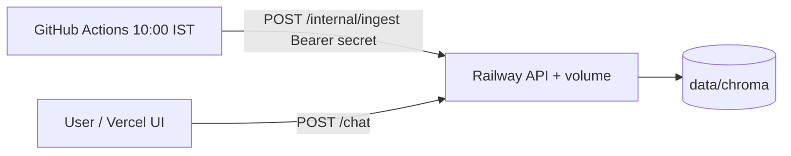

# Daily corpus refresh (10:00 AM IST)

Production users read answers from the **Chroma index on the Railway API service** (mounted volume). That index is refreshed **every day after 10:00 IST** when GitHub Actions calls `POST /internal/ingest` on the API.

**Setup:** [Deployment-plan.md](Deployment-plan.md) (Railway API + secrets) · [railway-ingest.md](railway-ingest.md) (API ingest endpoint)

---

## How it works



| Component | Role |
|-----------|------|
| **Railway API** | Volume at `data/chroma`; runs full ingest when triggered |
| **GitHub Actions** | [`daily-ingest.yml`](../.github/workflows/daily-ingest.yml) — `30 4 * * *` UTC = 10:00 IST |
| **Vercel UI** | `POST /chat` → API reads the current index (no redeploy after ingest) |

Ingest always runs **on the API host** (where the disk is). The workflow only sends one authenticated HTTP request; it does not build Chroma on the Actions runner.

---

## Schedule

| Local | Cron (UTC) | Workflow |
|-------|------------|----------|
| 10:00 IST | `30 4 * * *` | `.github/workflows/daily-ingest.yml` |

Scheduled runs use the **default branch** (usually `main`). You can also run manually: Actions → **Daily corpus refresh (10:00 IST)** → **Run workflow**.

---

## One-time setup

### Railway (API service)

| Variable | Value |
|----------|--------|
| `ENABLE_INTERNAL_INGEST` | `true` |
| `INGEST_TRIGGER_SECRET` | Long random string (e.g. `openssl rand -hex 32`) |
| `VECTOR_DB_PATH` | `data/chroma` (with volume at `/app/data`) |

**Bootstrap** before the first scheduled run (shell or one manual workflow run after secrets exist):

```bash
python -m src.ingest --manifest corpus/urls.yaml --no-save-raw
# or
curl -X POST "https://<api>/internal/ingest" -H "Authorization: Bearer <secret>"
```

### GitHub repository secrets

Settings → Secrets and variables → Actions → **Repository secrets**:

| Secret | Value |
|--------|--------|
| `RAILWAY_API_BASE_URL` | Public Railway API URL, e.g. `https://your-api.up.railway.app` (**must** be `https://` — `http://` returns HTTP 301 and fails the workflow; **no** trailing slash, **no** `/internal/ingest` path) |
| `INGEST_TRIGGER_SECRET` | **Same** as Railway `INGEST_TRIGGER_SECRET` |

---

## What users see

- Answer footer: `Last updated from sources: YYYY-MM-DD` from chunk `fetched_at`.
- **After** the day’s ingest **finishes** (often 10:00–11:00 IST depending on AMC fetch time), new chats use the updated index automatically.
- **Before** ingest completes that day, chats still use the previous index (yesterday’s successful run). Plan demos accordingly.
- No Vercel redeploy is required after ingest.

**Verify:**

```bash
curl https://<api>/corpus-status
```

Check `last_ingest` and `chunk_count` after a workflow run (Actions tab + Railway API logs: `Starting scheduled corpus ingest`).

---

## Optional: Railway cron (second service)

You do **not** need `railway.ingest.toml` or a second Railway service if GitHub Actions is configured as above. Use Railway cron only if you prefer private `*.railway.internal` triggers instead of a public `POST` (still Bearer-protected). See [railway-ingest.md](railway-ingest.md) § Option B.

---

## Local development

```bash
python -m src.ingest --manifest corpus/urls.yaml
```

Not scheduled locally. Wrappers: `scripts/run_daily_ingest.sh`, `scripts/run_daily_ingest.ps1`.

---

## Troubleshooting

| Issue | Check |
|-------|--------|
| Users see stale facts | `GET /corpus-status`; GitHub Actions run at/after 10:00 IST; Railway API logs |
| Workflow failed immediately | Repository secrets `RAILWAY_API_BASE_URL`, `INGEST_TRIGGER_SECRET` |
| Workflow 401/403 | Secret matches Railway `INGEST_TRIGGER_SECRET` |
| `/internal/ingest` 404 | `ENABLE_INTERNAL_INGEST=true` on API |
| Ingest 409 | Previous run still in progress; wait |
| Empty index | Bootstrap ingest on API |
| Schedule did not run | Workflow on default branch; repo Actions enabled; GitHub may delay cron a few minutes on busy runners |
