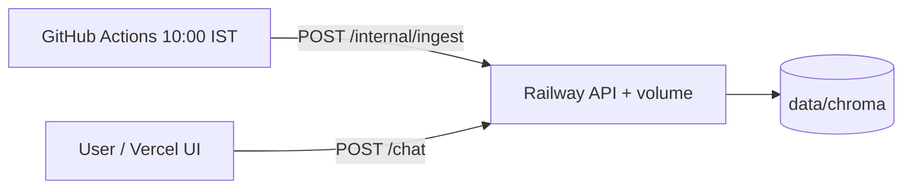

# Railway production ingest

Users see answers from the **Chroma index on the API service**. That index is refreshed **automatically every day at 10:00 IST** when something calls `POST /internal/ingest` on the API (ingest runs on the machine where the volume is mounted).

**Default scheduler:** GitHub Actions — [ingest-schedule.md](ingest-schedule.md) and [`.github/workflows/daily-ingest.yml`](../.github/workflows/daily-ingest.yml).



---

## 1. API service (required)

| Setting | Value |
|---------|--------|
| Config file | `railway.toml` (default) |
| Volume | Mount at `/app/data` |
| `VECTOR_DB_PATH` | `data/chroma` |
| `ENABLE_INTERNAL_INGEST` | `true` |
| `INGEST_TRIGGER_SECRET` | Long random string (e.g. `openssl rand -hex 32`) |

Other variables: `GROQ_API_KEY`, `CORS_ORIGINS`, etc. — see [deployment.md](deployment.md).

**GitHub Actions secrets** (same trigger, public API URL):

| Secret | Value |
|--------|--------|
| `RAILWAY_API_BASE_URL` | `https://<your-api>.up.railway.app` (no trailing slash) |
| `INGEST_TRIGGER_SECRET` | Same as Railway |

**First-time bootstrap** (before the first 10:00 IST run):

```bash
# Railway → API service → Shell
pip install -r requirements-phase1.txt
python -m src.ingest --manifest corpus/urls.yaml --no-save-raw
```

Or:

```bash
curl -X POST "https://<api>/internal/ingest" -H "Authorization: Bearer <secret>"
```

Only works when `ENABLE_INTERNAL_INGEST=true`.

**Verify:**

```bash
curl https://<api>/corpus-status
```

---

## 2. What users see

- Footer dates come from chunk `fetched_at` after ingest re-indexes AMC pages.
- After the day’s ingest **completes**, new chats use the refreshed index — no redeploy.
- Until ingest finishes, chats use the last successful index.

---

## 3. Option B — Railway cron (optional)

Use this **instead of** GitHub Actions scheduling if you want the trigger on Railway private networking only (no second Chroma copy — cron only POSTs to the API).

Railway **cannot attach one volume to two services**, so the cron service has **no volume**; it only calls the API.

| Setting | Value |
|---------|--------|
| Config file path | `railway.ingest.toml` |
| Cron schedule | `30 4 * * *` UTC (10:00 IST) |
| Volume | **None** |

**Variables** (cron service only):

| Variable | Example |
|----------|---------|
| `INGEST_TRIGGER_URL` | `http://<API_SERVICE_NAME>.railway.internal:<PORT>/internal/ingest` |
| `INGEST_TRIGGER_SECRET` | Same as API service |

Do **not** run both GitHub Actions schedule and Railway cron unless you intend redundant triggers (409 if overlap).

---

## 4. Troubleshooting

| Issue | Fix |
|-------|-----|
| Chat empty / stale | Bootstrap ingest; `GET /corpus-status` `chunk_count` |
| GitHub workflow fails | Set `RAILWAY_API_BASE_URL` + `INGEST_TRIGGER_SECRET` in repo secrets |
| Trigger 401/403 | Match `INGEST_TRIGGER_SECRET` on API and GitHub |
| Ingest 409 | Previous run in progress |
| `ENABLE_INTERNAL_INGEST` false | Endpoint returns 404 |
